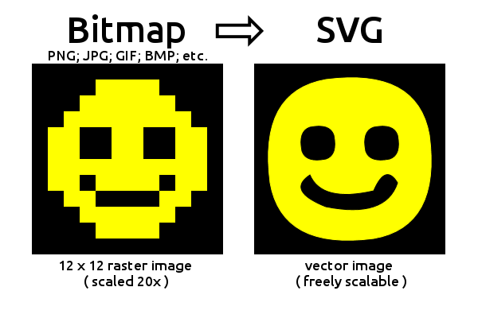

# @marmooo/imagetracer



Simple raster image tracer and vectorizer written in JavaScript.

## Usage

```
import { OctreeQuantization } from "npm:@marmooo/color-reducer";
import { toSVG, toTraceData } from "npm:@marmooo/imagetracer";

const imageData = new ImageData(dataArray, 64, 64);
const { width, height } = imageData;
const quantizer = OctreeQuantization(imageData);
quantizer.apply(256);
const { replaceColors } = quantizer;
const indexedImage = quantizer.getIndexedImage();
const svg = toSVG(indexedImage, width, height, replaceColors, options);
const traceData = toTraceData(indexedImage, width, height, replaceColors, options);
```

## Process overview

See [process overview and ideas for improvement](docs/process_overview.md).

## Features

- simplify API from original
  ([imagetracerjs](https://github.com/jankovicsandras/imagetracerjs))
- support ESM & Deno
- support multiple quantization algorithms (use
  [@marmooo/color-reducer](https://github.com/marmooo/color-reducer))
- minify & optimize output SVG
- add benchmarks & improve performance
- add tests & fixed some bugs

## Test

```
deno test --allow-read
deno bench --allow-read
deno run --allow-read src/svg_size.js
```
