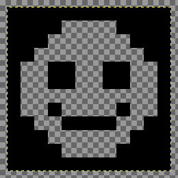
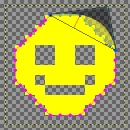

# Process overview

## 1. Color quantization

@marmooo/imagetracer requires
[indexed image](https://en.wikipedia.org/wiki/Indexed_color). It can be created
by using [@marmooo/color-reducer](https://github.com/marmooo/color-reducer)
supported below algorithms.

- [Median cut](https://en.wikipedia.org/wiki/Median_cut)
- [Octree quantization](https://en.wikipedia.org/wiki/Octree)
- Uniform quantization

## 2. Layer separation and edge detection

The **detectEdges** function creates arrays for every color, and calculates edge
node types. These are at the center of every 4 pixels, shown here as dots. This,
**scanPaths** and **smoothPaths** are a reinvented variant of the marching
squares algorithm.

- [Marching squares](https://en.wikipedia.org/wiki/Marching_squares)

 

## 3. Scan paths

The **scanPaths** function finds chains of edge nodes, example: the cyan dots
and lines.

## 4. Interpolation

The **smoothPaths** function interpolates the coordinates of the edge node
paths. Every line segment in the new path has one of the 8 directions (East,
North East, N, NW, W, SW, S, SE).

 

## 5. Tracing

The **trace** function splits the interpolated paths into sequences with two
directions.

The **fit** function tries to fit a straight line on the start- and endpoint of
the sequence (black line). If the distance error between the calculated points
(black line) and actual sequence points (blue dots) is greater than the
treshold, the point with the greatest error is selected (red line).

The **fit** function tries to fit a quadratic spline through the error point.

If the **fit** function can not fit a straight line or a quadratic spline to the
sequence with the given error tresholds, then it will split the sequence in two
and recursively call **fit** on each part.

- [Divide-and-conquer algorithm](https://en.wikipedia.org/wiki/Divide_and_conquer_algorithm)

## 6. SVG rendering

The coordinates are rendered to
[SVG Paths](https://developer.mozilla.org/en-US/Web/SVG/Tutorial/Paths) in the
**toSVGString** function.

# Ideas for improvement

- Error handling: there's very little error handling now, Out of memory can
  happen easily with big images or many layers.
- Tracing: 5.1. finding more suitable sequences.
- Tracing: 5.5. splitPos = fitPos ; this is just a guess, there might be a
  better splitPos.
- Tracing: 5.7. If splitPos-endPos is a spline, try to add new points from the
  next sequence; this is not implemented.
- Tracing: cubic splines or other curves?
- Output: [PDF](https://en.wikipedia.org/wiki/Portable_Document_Format),
  [DXF](https://en.wikipedia.org/wiki/AutoCAD_DXF),
  [G-code](https://en.wikipedia.org/wiki/G-code) or other output?
- comparing and integrating ideas from
  [Potrace](https://en.wikipedia.org/wiki/Potrace)
- [Centerline tracing](https://github.com/jankovicsandras/imagetracerjs/issues/65)
